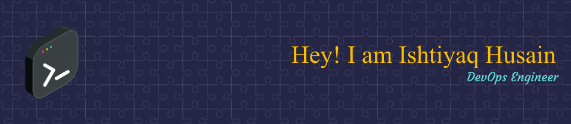

  
### <div align="center">I'm Ishtiyaq Husain [(lessons4you)](https://ishtiyaq.com), a DevOps Engineer, content creator, and a HomeLab enthusiast.   I create fun and easy to follow tech content on [YouTube](https://ishtiyaq.com)</div>  
  

- 🌱 I’m currently learning Ansible and Kubernetes  
  

- ❓ Ask me about anything related to technologies  
  

<br/>  


## My Skill Set  
<table><tr><td valign="top" width="100%">

<div align="center">  
  
  
  
  
  
  
  
  
  
  
  
  
  
  
  
  
  
  
  
  
  
  
  
  
  
  
  
  
  
  
  
  
  
</div>

</td></tr></table>  

<br/>  


## 👋 Connect with me  

[](https://github.com/ishtiyaq)
[](https://github.com/ishtiyaq)
[](https://www.youtube.com/c/IshtiyaqHusain?sub_confirmation=1) 
[](https://www.youtube.com/c/Lessons4You?sub_confirmation=1) 
[](https://twitter.com/ishtiyaqhu)
[](https://discord.gg/pfNfPfff)

<br/>  

## ☕ If you like what I do, maybe consider buying me a coffee/tea

<a href="https://www.buymeacoffee.com/ishtiyaq" target="_blank"></a>

<br/>

## 📊 Github Stats  


[](https://git.io/streak-stats)

<br/>

## Stack Overflow

[](https://stackoverflow.com/users/5458184/ishtiyaq-husain)

<br/>

[](https://github.com/ishtiyaq/github-profile-trophy)

## Blog posts

<!-- BLOG-POST-LIST:START -->
- [How To Install The TWRP Recovery on Xiaomi Redmi 1s](https://lessons4you.info/how-to-install-the-twrp-recovery-on-xiaomi-redmi-1s)
- [MIUI Collection Of Gapps &lpar;2.3.x – 5.0.x&rpar;](https://lessons4you.info/miui-collection-of-gapps)
- [Download Android 5.1.x Lollipop PA Gapps](https://lessons4you.info/download-android-5-1-x-lollipop-pa-gapps)
- [Download gapps for Android 5.1 Lollipop Cyanogemod 12.1](https://lessons4you.info/download-gapps-for-android-5-1-lollipop-cyanogemod-12-1)
- [Reddit AMA with OxygenOS Team OnePlus](https://lessons4you.info/reddit-ama-with-oxygenos-team-oneplus)
<!-- BLOG-POST-LIST:END -->

<!--START_SECTION:waka-->


**🐱 My GitHub Data** 

> 🏆 83 Contributions in the Year 2022
 > 
> 📦 972 Bytes Used in GitHub's Storage 
 > 
> 🚫 Not Opted to Hire
 > 
> 📜 19 Public Repositories 
 > 
> 🔑 3 Private Repositories  
 > 
**I Mostly Code in Shell** 

```text
Shell                    6 repos             █████████████░░░░░░░░░░░░   54.55% 
PHP                      2 repos             ████░░░░░░░░░░░░░░░░░░░░░   18.18% 
Dockerfile               2 repos             ████░░░░░░░░░░░░░░░░░░░░░   18.18% 
JavaScript               1 repo              ██░░░░░░░░░░░░░░░░░░░░░░░   9.09%

```


**Timeline**

 


 Last Updated on 26/09/2022 18:52:24 UTC
<!--END_SECTION:waka-->
